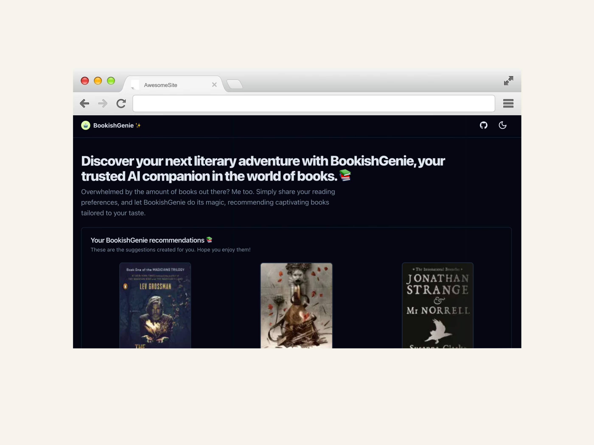

<div align="center">
  
  <h1 align="center">AI NovelSeeker</h1>
</div>

Discover your next literary adventure with AI NovelSeeker, your trusted AI companion in the world of books. 📚

<div align="center">
  
  <p align="center">AI NovelSeeker Desktop Preview</h1>
</div>

## Project intro

AI NovelSeeker is a web application that aims to simplify the process of finding your next captivating book to read. With a few simple steps, you can share your reading preferences and let AI NovelSeeker's AI recommendation engine do its magic, providing personalized book recommendations tailored to your taste.

## Features

- **Step-by-step Wizard**: AI NovelSeeker provides a user-friendly step-by-step wizard interface to collect your reading preferences. You'll be guided through selecting your favorite genre, mood, and book length preference.

- **AI-powered Recommendations**: AI NovelSeeker utilizes the power of artificial intelligence to generate personalized book recommendations based on your preferences. The recommendations are generated using the OpenAI GPT-3.5 Turbo model.

- **Book Information**: AI NovelSeeker not only provides recommendations but also fetches detailed book information, including book covers and other metadata. It uses the Google Books API to retrieve book information based on the recommendations.

- **Persistent Storage**: AI NovelSeeker stores your recommendations and book information in the browser's localStorage, allowing you to revisit your recommendations without losing them.

## Technologies

- React
- Next.js
- Zustand
- Tailwind CSS
- shadcn/ui
- OpenAI GPT-3.5 Turbo
- Google Books API

## Getting Started

Follow the instructions below to get the project up and running on your local machine.

### Installation

1. Clone the repository:

```bash
git clone https://github.com/.../commune-AI-NovelSeeker.git
```

2. Navigate to the project directory:

```bash
cd bookish-genie
```

3. Install dependencies:

```bash
npm install
```

4. Set up environment variables:
   - Create a new file named `.env.local` in the project root directory.
   - Add the following lines to the `.env.local` file:

```bash
# .env.local

NEXT_PUBLIC_OPEN_AI_API_KEY=your-openai-api-key
NEXT_PUBLIC_GOOGLE_BOOKS_API_KEY=your-google-books-api-key
```

5. Start the development server:

```bash
npm run dev
```

6. Open your browser and visit `http://localhost:3000` to see the application running.

## Contributing

Contributions are welcome! If you find any issues or have suggestions for improvement, please create an issue or submit a pull request.

